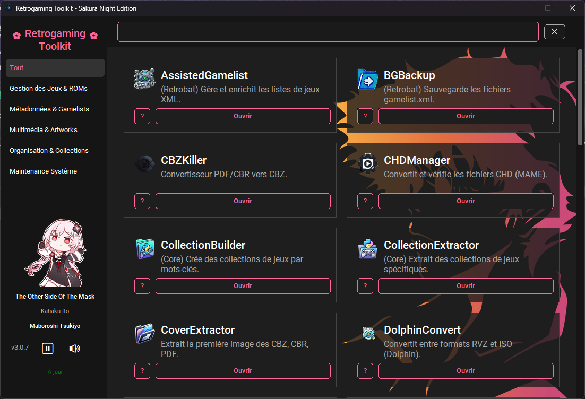

# 🕹️ Retrogaming Toolkit AIO

**La boîte à outils ultime pour les passionnés d'émulation et de retrogaming.**

**Retrogaming Toolkit AIO** est une suite logicielle centralisée et modulaire regroupant plus de 25 outils puissants pour automatiser, nettoyer, optimiser et organiser votre collection de jeux. Conçu pour s'intégrer parfaitement avec des frontends populaires comme **RetroBat**, **EmulationStation**, **Batocera** ou **HyperSpin**, ce programme vous fait gagner un temps précieux dans la gestion de vos ROMs, de vos médias et de vos fichiers de configuration.

---

## 📋 Table des Matières

- [✨ Fonctionnalités Principales](#-fonctionnalités-principales)
- [🛠️ Liste des Modules](#️-liste-des-modules)
  - [Gestion des Jeux & ROMs](#gestion-des-jeux--roms)
  - [Métadonnées & Gamelists](#métadonnées--gamelists)
  - [Multimédia & Artworks](#multimédia--artworks)
  - [Organisation & Collections](#organisation--collections)
  - [Maintenance Système](#maintenance-système)
- [🚀 Installation](#-installation)
- [💻 Utilisation](#-utilisation)
- [🔄 Mises à jour](#-mises-à-jour)

---

## ✨ Fonctionnalités Principales

* **Interface Unifiée & Intuitive :** Une GUI moderne et sombre (basée sur `customtkinter`) regroupant tous les scripts.
* **Architecture Modulaire :** Chaque outil est indépendant ; vous ne lancez que ce dont vous avez besoin.
* **Performance Multithread :** Utilisation optimale de tous les cœurs de votre processeur pour les tâches lourdes (compression CHD, conversion vidéo, etc.).
* **Gestion Automatique des Dépendances :** Le toolkit télécharge et configure automatiquement les outils externes manquants (`ffmpeg`, `chdman`, `maxcso`, `DolphinTool`, etc.).
* **Documentation Intégrée :** Accès direct au manuel de chaque module via un bouton "Lisez-moi" dans l'interface.
* **Mise à Jour Intelligente :** Vérification et installation automatique des dernières versions de la suite depuis GitHub.

---

## 🛠️ Liste des Modules

### 🎮 Gestion des Jeux & ROMs
Optimisez votre stockage et gérez vos fichiers de jeux avec des outils de compression de pointe.

* **💿 CHDManager :**
    * Convertit les images disques (ISO, CUE, GDI) en format **CHD** compressé pour économiser de l'espace (PS1, Dreamcast, Saturn...).
    * Gère l'extraction automatique des archives **ZIP/RAR/7Z** en entrée.
    * Permet l'opération inverse (CHD vers CUE/BIN).
    * Utilisation multi-cœurs pour une vitesse maximale.
* **🗜️ MaxCSO :**
    * Compression ultra-rapide des ISO (PSP/PS2) en format **CSO** ou **ZSO**.
    * Réduction drastique de la taille tout en restant lisible par les émulateurs.
    * Traitement par lots de dossiers entiers.
* **🐬 DolphinConvert :**
    * Conversion "sans perte" pour GameCube et Wii via **DolphinTool**.
    * Transforme les ISO en **RVZ** (et inversement) pour une compression optimale compatible avec Dolphin.
    * Téléchargement automatique de DolphinTool si absent.
* **📦 FolderToZip :**
    * Compresse chaque jeu (dossier) dans une archive ZIP individuelle.
    * Supprime automatiquement le dossier original après compression réussie.
* **🚀 GameBatch :**
    * Génère des scripts `.bat` pour lancer vos jeux PC (Windows, Steam, Epic) via votre frontend.
    * Lanceur universel prêt à l'emploi (surveillance du processus pour fermeture propre).
* **🗑️ GameRemoval :**
    * Supprime proprement un jeu et **tous** ses médias associés (images, vidéos, manuels).
    * Évite les fichiers orphelins dans vos dossiers médias.
* **🧹 UniversalRomCleaner :**
    * Nettoie et trie vos ROMs (1G1R, Régions) pour garder une collection propre.

### 📋 Métadonnées & Gamelists
Manipulez, nettoyez et enrichissez vos fichiers XML pour RetroBat, EmulationStation et HyperSpin.

* **🤖 AssistedGamelist :**
    * Utilise l'**Intelligence Artificielle** (Gemini 2.5 Flash via Google AI) pour générer les descriptions manquantes.
    * Scanne vos `gamelist.xml` et complète les synopsis sans écraser les données existantes.
* **🔄 GamelistHyperlist :**
    * Convertit `gamelist.xml` (RetroBat/ES) vers le format `hyperlist.xml` (HyperSpin/AttractMode).
    * Extrait les descriptions dans des fichiers texte individuels pour l'archivage.
* **↩️ HyperlistGamelist :**
    * Migrez vos bases de données HyperSpin vers le format standard `gamelist.xml`.
    * Reformate les dates, notes et chemins d'accès (extensions zip, 7z, iso...).
* **🛡️ BGBackup :**
    * "Assurance-vie" de vos métadonnées : scanne et sauvegarde tous les `gamelist.xml` dans une archive ZIP.
    * Idéal avant de lancer un scraper ou une modification massive.
* **📝 StoryHyperlist :**
    * Fusionne une collection de synopsis (fichiers .txt) directement dans votre XML HyperList.
    * Gère les encodages pour éviter les caractères corrompus.
* **🧹 StoryCleaner :**
    * Nettoie les fichiers textes (biographies, histoires) pour les standards XML.
    * Remplace les caractères spéciaux et corrige les symboles critiques (comme `&` en `&amp;`).
* **⚙️ SystemsExtractor :**
    * Compare votre `es_systems.cfg` avec la version officielle.
    * Extrait vos systèmes personnalisés dans des fichiers dédiés pour éviter les pertes lors des mises à jour.

### 🎨 Multimédia & Artworks
Gérez vos assets visuels et vidéos pour une bibliothèque esthétique.

* **📺 YTDownloader :**
    * Interface graphique pour `yt-dlp`.
    * Téléchargement de vidéos uniques, playlists ou chaînes entières.
    * Choix du format : **Audio MP3** ou **Vidéo (jusqu'en 4K)**.
    * Mode "Copie Rapide" pour assembler audio/vidéo sans ré-encodage.
* **🎥 VideoConvert :**
    * Traitement en masse : conversion, redimensionnement (720p/1080p), et découpe (trim).
    * Extraction automatique de **screenshots** depuis la vidéo pour créer des couvertures.
    * Téléchargement auto de FFmpeg.
* **🖼️ ImageConvert :**
    * Conversion de dossiers entiers vers le format cible (WebP, PNG, JPG...).
    * Option de nettoyage pour supprimer les originaux.
* **📖 CoverExtractor :**
    * Génère des miniatures (PNG) à partir de la première page de fichiers **PDF, CBZ et CBR**.
    * Indispensable pour les magazines et comics.
* **🧹 MediaOrphans :**
    * Scanne le dossier `medium_artwork` et déplace les images sans jeu associé vers un dossier `orphan`.
    * Préserve les images système (`default`).
* **📚 CBZKiller :**
    * Convertit massivement **PDF et CBR** en format **CBZ** standardisé.
    * Option pour supprimer les fichiers source après conversion.

### 🗂️ Organisation & Collections
Structurez votre ludothèque et créez des compilations thématiques.

* **📂 CollectionBuilder :**
    * Crée des collections thématiques (ex: "Zelda", "Mario") en scannant les mots-clés dans vos descriptions.
    * Génère la structure de dossiers et les playlists `.sub`.
* **📦 CollectionExtractor :**
    * Extrait "chirurgicalement" une collection complète (roms + médias + configs + cœurs) vers un dossier autonome.
    * Idéal pour créer des packs portables ou partager une configuration système.
* **💿 M3UCreator :**
    * **Multi-disques :** Génère les fichiers `.m3u` pour regrouper les CD (PS1, Dreamcast...).
    * **Vita3K :** Crée des `.m3u` avec le nom réel du jeu à partir des ID cryptiques (PCSB...).
* **🧹 FolderCleaner :**
    * Supprime récursivement tous les dossiers vides pour nettoyer l'arborescence.
* **📄 FolderToTxt :**
    * Crée un fichier texte vide portant le nom de chaque fichier trouvé (pour les scrappers exigeants).
* **📄 EmptyGen :**
    * Génère des fichiers vides ("dummy files") pour les émulateurs spécifiques (ex: `.scummvm`, `.singe`).
    * Parcourt l'arborescence pour placer les fichiers dans les bons sous-dossiers.
* **🎁 PackWrapper :**
    * Crée des packs de mise à jour/différence (ZIP ou EXE SFX) en comparant votre version modifiée à l'originale.
    * Gère intelligemment les structures Retrobat et RetroFE (séparation système/contenu).
    * Idéal pour partager vos thèmes ou configurations sans redistribuer tout le système.
* **📋 PatternCopier :**
    * Copie intelligente de fichiers basée sur un modèle (fichier témoin).
    * Préserve l'arborescence relative (idéal pour extraire des assets spécifiques comme les artworks).
    * Interface graphique avec suivi de progression.

### 🛠️ Maintenance Système
Outils essentiels pour un environnement Windows sain.

* **🛣️ LongPaths :**
    * Modifie le registre Windows pour supporter les chemins > 260 caractères.
    * Évite les erreurs de copie/extraction avec les noms de fichiers longs.
* **🛠️ InstallDeps :**
    * Installe/Met à jour les **Visual C++ Runtimes (AIO)**, **DirectX** et **OpenAL**.
    * Détection automatique de l'architecture (x86/x64) et installation silencieuse.
* **📝 ListFilesSimple / ListFilesWin :**
    * Génère des inventaires textuels (`Liste.txt`) du contenu de vos dossiers (arborescence complète ou racine uniquement).

---

## 🚀 Installation

1.  Rendez-vous sur la page des [**Releases GitHub**](https://github.com/Balrog57/Retrogaming-Toolkit-AIO/releases/latest).
2.  Téléchargez le fichier **`RetrogamingToolkit_Setup.exe`**.
3.  Lancez l'installation et profitez de la boîte à outils !

---

## 💻 Utilisation

1.  Ouvrez **Retrogaming Toolkit AIO**.
2.  Naviguez entre les pages de modules via les boutons **< Précédent** et **Suivant >**.
3.  Survolez ou consultez la description sous chaque icône.
4.  Cliquez sur le bouton **"Lisez-moi"** associé à un module pour le guide détaillé.
5.  Cliquez sur le **Nom du module** pour lancer l'outil dans une nouvelle fenêtre.

> **Note importante :** Les outils nécessitant des dépendances externes (comme `FFmpeg`, `CHDman`, `MaxCSO`) les téléchargeront **automatiquement et silencieusement** lors de leur première utilisation ou au lancement du toolkit. Aucune action de votre part n'est requise.

---

## 🔄 Mises à jour

Le logiciel intègre un système de vérification de version :

*   Au lancement, il compare votre version locale avec la dernière disponible sur GitHub.
*   Si une nouvelle version est disponible, une notification verte apparaît en bas de l'interface.
*   Cliquez sur **"Mettre à jour"** : cela vous dirigera vers la page de téléchargement de la nouvelle version. Il vous suffit de l'installer par-dessus l'ancienne.

---
*Développé avec ❤️ pour la communauté de l'émulation.*

---

## 🖥️ Aperçu de l'Interface

